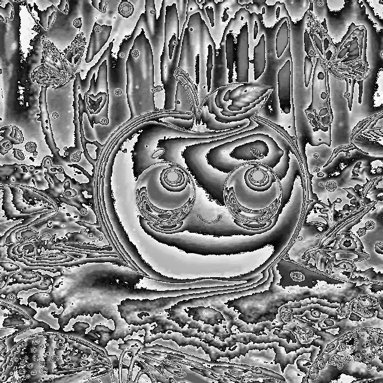

### 1-byte Greyscale Image Convolution

- [x] 1D array convolution  
    uses symmetric padding at borders

- [ ] 2D array convolution

<table>
<tr>
<td></td>
<td></td>
</tr>
</table>

### How to run:

```bash
./init.sh
./run.sh
```
